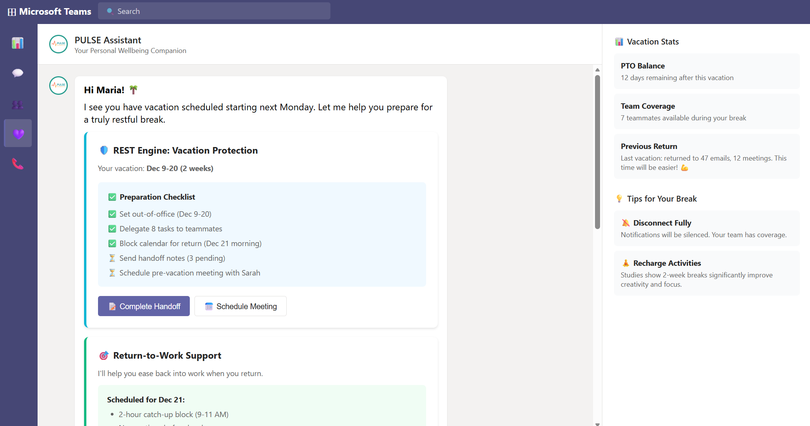
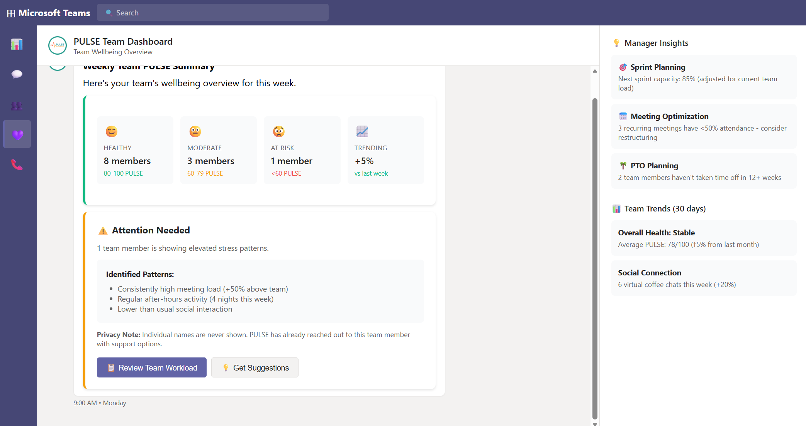

# 🫀 PULSE - The Invisible Safety Net

> *"Your tools already know. PULSE makes them care."*

**Team BalanceSphere** | EPAM Wellbeing Ideathon 2025

---

## 🎯 What is PULSE?

PULSE is a **personal AI wellbeing companion** integrated into Microsoft Teams that proactively detects burnout risk and offers actionable support—before it's too late.

### The Problem We're Solving

**"The Project Was Green. The Person Was Yellow."**

While EPAM's 16+ systems track projects, deliverables, and technical health, **no system watches for the human cost**:
- 😰 Arjun: Coding until 1 AM for 3 weeks
- 😔 Maria: Carrying invisible presales workload
- 😶 Alex: No informal conversations in 4 weeks
- 😟 Jordan: Dreading vacation due to return chaos

---

## 🚀 Our Solution

### Three Core Engines

| Engine | Purpose | What It Does |
|--------|---------|--------------|
| 🔥 **LOAD** | "Who's drowning?" | Monitors workload patterns, provides proactive check-ins |
| 🛡️ **REST** | "Can you rest?" | Vacation prep, return-to-work support, PTO protection |
| 💚 **BOND** | "Are you connected?" | Social connection monitoring, virtual coffee matching |

### Key Features
- ✅ **Proactive AI Assistant** - Reaches out before burnout happens
- ✅ **Microsoft Teams Native** - No new apps, seamless integration
- ✅ **Privacy-First Design** - Employees own their data, managers see patterns only
- ✅ **Actionable Insights** - Not just monitoring, but real solutions

---

## 📊 Business Impact

| Metric | Value |
|--------|-------|
| Cost of employee replacement | **$150,000** |
| Burnout attrition (1,000 employees) | ~180 people = $27M/year |
| PULSE prevents 20% of burnout | 36 people saved |
| **Annual savings** | **$5.4M** |
| Phase 1 investment | ~$165K |

### **33x ROI in Year One**

---

## 📁 Repository Contents

### 📄 Key Documents

- **[PULSE - BalanceSphere.pptx](./PULSE%20-%20BalanceSphere.pptx)** - Main presentation (11 slides)
- **[PULSE_FINAL_PITCH.md](./PULSE_FINAL_PITCH.md)** - Complete pitch document
- **[mockups/pulse-teams-mockup.html](./mockups/pulse-teams-mockup.html)** - Interactive UI mockups

### 🖼️ Screenshots & Mockups

<table>
<tr>
<td width="33%">

<strong>LOAD Engine</strong> Proactive Check-in

</td>
<td width="33%">

<strong>REST Engine</strong> Vacation Protection

</td>
<td width="33%">

<strong>Manager Dashboard</strong> Privacy-First View

</td>
</tr>
</table>

### 🧪 Research & Development

- [AliakseisResearch.md](./AliakseisResearch.md) - Infrastructure & architecture research
- [OlegsResearchAndProposal.md](./OlegsResearchAndProposal.md) - AI/ML integration analysis
- [MarinsResearchAndProposal.md](./MarinsResearchAndProposal.md) - Delivery & implementation strategy
- [PROBLEM_AREAS_FOR_PRIORITIZATION.md](./PROBLEM_AREAS_FOR_PRIORITIZATION.md) - Problem domain analysis

---

## 👥 Team BalanceSphere

<table>
<tr>
<td align="center" width="25%">

  
<strong>🎯 Hunkar Gocen</strong> 
<em>Senior Manager, Data & Analytics</em> 
Data strategy & analytics vision
</td>
<td align="center" width="25%">
  
<strong>🔧 Oleg Sidorenko</strong> 
<em>Data Solution Architect</em> 
AI/ML integration & architecture
</td>
<td align="center" width="25%">
  
<strong>🤖 Aliaksei Babuk</strong> 
<em>Cloud Engineering Manager</em> 
Infrastructure & scalability
</td>
<td align="center" width="25%">
  
<strong>🎨 Marin Komadina</strong> 
<em>Senior Delivery Manager</em> 
Implementation & change management
</td>
</tr>
</table>

> **Together:** 40+ years building enterprise solutions that put people first.

---

## 🎨 Brand Assets

&nbsp;&nbsp;&nbsp;&nbsp;

---

## 🔒 Privacy & Trust

**Our Privacy Firewall:**
- ✅ **Opt-In Only** - Explicit consent required
- ✅ **Employee Owns Data** - Full visibility & control
- ✅ **Patterns, Not Policing** - Aggregates only, no surveillance
- ✅ **Managers See Teams** - Never individual names ("1 member needs attention")
- ✅ **No Performance Link** - Never used for reviews

---

## 🛠️ Technical Stack

- **Frontend:** Microsoft Teams App (React)
- **AI/ML:** Azure OpenAI, Pattern Recognition Models
- **Data Integration:** Microsoft Graph API, EPAM Systems APIs
- **Backend:** Azure Functions, Event-Driven Architecture
- **Storage:** Azure Cosmos DB (compliance-ready)
- **Analytics:** Power BI, Custom Dashboards

---

## 📞 Contact & Links

- **Repository:** [github.com/hunkar-gocen-epam/BalanceSphere](https://github.com/hunkar-gocen-epam/BalanceSphere)
- **Presentation:** [Download PPTX](./PULSE%20-%20BalanceSphere.pptx)
- **Interactive Demo:** [View Mockups](./mockups/pulse-teams-mockup.html)

---

## 📜 License & Acknowledgments

**EPAM Wellbeing Ideathon 2025**

Special thanks to EPAM leadership for prioritizing employee wellbeing and fostering innovation through this ideathon.

---

<strong>PULSE: Making EPAM's tools care about people, not just projects.</strong>

